Background: Why HoloViz?
========================

Many of the activities of an engineer, scientist, or analyst require
visualization, but it can be difficult to assemble a set of tools that
cover all of the tasks involved. Initial exploration needs to be in a
flexible, open-ended environment where it is simple to try out and test
hypotheses. Once key aspects of the data have been identified, the
analyst might prepare a specific image or figure to share with
colleagues or a wider audience. Or, they might need to set up an
interactive way to share a set of data that would be unwieldy as a fixed
figure, using interactive controls to let others explore the effects of
certain variables. Eventually, for particularly important data or use
cases, the analyst might get involved in a long-term project to develop
a full-featured web application or dashboard to deploy, allowing
decision makers to interact directly with live data streams to make
operational decisions.

With Python, initial exploration is typically in a
`Jupyter <https://jupyter.org>`__ notebook, using tools like Matplotlib
and Bokeh to develop static or interactive plots. These tools support a
simple syntax for making certain kinds of plots, but showing more
complex relationships in data can quickly turn into a major software
development exercise, making it difficult to achieve understanding
during exploration. Various toolkits like Bokeh, Dash, and ipywidgets
allow building apps to control and explore these visualizations
interactively rather than recoding each time, but again outside of a
small range of simple functions building the app itself becomes a
major software development exercise. Plotting libraries also have
limitations on how much data they can handle, especially if they
require that all of the data be present in the web browser's limited
memory space. It is thus difficult to find tools that support anything
close to the entire range of cases where data needs to be visualized.

The HoloViz ecosystem
---------------------

*holo* : *Greek* root, meaning *whole*, *entire*.

To address all the above issues, we have developed a set of open-source Python
packages to streamline the entire process of working with small and large datasets
(from a few datapoints to billions or more) in a web browser, whether doing
exploratory analysis, making simple widget-based tools, or building
multipage standalone dashboards. Building on existing plotting libraries like
`Bokeh <https://bokeh.org>`__, `Matplotlib <https://matplotlib.org>`__, and
`Plotly <https://plot.ly>`__, the HoloViz ecosystem includes a set of special-purpose tools designed to fill in the gaps and solve the whole problem of visualization:

-  `Panel <https://panel.holoviz.org>`__: Assembling objects from
   many different libraries into a layout or app, whether in a Jupyter
   notebook or in a standalone servable dashboard
-  `hvPlot <https://hvplot.holoviz.org>`__: Quickly return interactive
   HoloViews, GeoViews, or Panel objects from Pandas, Xarray,
   or other data structures
-  `HoloViews <https://holoviews.org>`__: Declarative objects for
   instantly visualizable data, building Bokeh plots from convenient
   high-level specifications
-  `GeoViews <https://geoviews.org>`__: Visualizable geographic
   data that that can be mixed and matched with HoloViews objects
-  `Datashader <https://datashader.org>`__: Rasterizing
   huge datasets quickly as fixed-size images
-  `Lumen <https://lumen.holoviz.org>`__: Framework for visual analytics that allows users
   to build data-driven dashboards from a simple YAML specification
-  `Colorcet <https://colorcet.holoviz.org>`__: A wide range of perceptually uniform continuous colormaps and perceptually based categorical color sets for use with the other libraries

Assuming that you have some data of some particular **Data type**, the
chart below will help you choose a suitable Python **Data library**
for reading in the data and working with it, and then a suitable
**HoloViz API** for specifying plots of that type of data, including
**optional HoloViz libraries**.  Given these choices, you can then
choose an appropriate **Plotting library** for actually rendering
visualizations, along with a **Dashboarding library** if you need one:

Each of these steps is just a suggestion, presented here to show
you how we designed the HoloViz tools, and how everything is *meant*
to fit together. You are welcome to combine these tools or anything
else from Python any way you like. For instance, you do not *have* to
use GeoPandas or GeoViews if you are working with geospatial columnar
data; you can use regular Pandas and handle projections and other
geospatial operations yourself. You do not *have* to use Datashader if
you have large datasets; you can simply subsample or select your data
into a small enough subset that it becomes feasible with other
tools. You do not *have* to use Streamz for working with streaming
data; it just makes it simpler. So please use whatever library you
wish, now that you know what our suggestions are and how we mean it to
fit together!

Shortcuts, not dead ends
------------------------

As you can see, the tools are designed to solve the problems of very
different users working on very different tasks, which reflects the
diversity of users and needs for data visualization.  Casual users
will often want a quick way to get something that works well enough,
while a dedicated technical user with specialized needs will want
detailed control over each aspect, which usually means a different and
more low-level tool.  But because many people fall in between these
extremes, and because individual users often travel on a trajectory
from casual user to power user as their needs become more precise, the
tools are also designed to transition easily between each of these
different approaches.

That is, these tools are designed to offer simplified, high-level
interfaces that are easy ways for users to get started, but those easy
ways should truly be starting points, not dead ends.  To illustrate
this point, consider three different types of tools -- low level, high
level, and layered:

.. image:: assets/shortcuts.png
    :height: 300px

A low-level tool is highly configurable, with an expressive but
relatively verbose command language that makes it possible to
precisely control how it works. For HoloViz, Bokeh is a low-level tool,
allowing any plot or app to be built up from basic primitives. An
even lower-level approach would be to write javascript directly. A
high-level tool like hvPlot or like Panel's interact function uses
much less code and a much simpler interface to make a powerful plot or
dashboard, but what do you do if you then need to make some small
changes in the result?

Typical high-level tools will just be dead ends at this point, forcing
you to start over if what they provide isn't what you needed. HoloViz
high-level tools are instead systematically designed as layers on
top of lower-level tools, where you can use the top level for anything
that it provides, while always being able to drop down a level (or
several if necessary!) to get the behavior you need.

Panel's `interact function <https://panel.holoviz.org/tutorials/intermediate/interactivity.html>`_
provides a clear example of this approach. With one line of Panel code
you can get a fully functional widget-based app.  But if it's not
precisely what you want, you can then inspect what's returned, unpack
it, rearrange and add or delete components, then use the result
instead.  Similarly, hvPlot provides a one-line way to return complex
HoloViews objects, which can then be inspected, pulled apart,
reconfigured, and recomposed if/as needed. And then these HoloViews
objects, in turn, can be used to make a Bokeh or Matplotlib figure
that again can be examined, modified, and used in other contexts.

Building on the Python scientific ecosystem
-------------------------------------------

Beyond the specific HoloViz tools, all these approaches work with and
often rely upon a wide range of other open-source libraries for their
implementation, including:

-  `Pandas <https://pandas.pydata.org>`__: Convenient computation on
   columnar datasets (used by HoloViews and datashader)
-  `Xarray <https://xarray.pydata.org>`__: Convenient computations on
   multidimensional array datasets (used by HoloViews and Datashader)
-  `Dask <https://dask.org>`__: Efficient
   out-of-core/distributed computation on massive datasets (used by
   Datashader)
-  `Numba <https://numba.pydata.org>`__: Accelerated machine code for
   inner loops (used by Datashader)
-  `Fastparquet <https://fastparquet.readthedocs.io>`__: Efficient
   storage for columnar data
-  `Cartopy <https://scitools.org.uk/cartopy>`__: Support for
   geographical data (using a wide range of other lower-level libraries)

These and many other tools form the broader ecosystem that supports
HoloViz. The HoloViz tutorials will guide you through the process of
using these tools together to build rich, high-performance, scalable,
flexible, and deployable visualizations, apps, and dashboards, without
having to use JavaScript or other web technologies explicitly, and
without having to rewrite your code to move between each of the
different tasks or phases from exploration to deployment. In each
case, we'll try to draw your attention to libraries and approaches
that help you get the job done, which in turn depend on many other
unseen libraries in the scientific Python ecosystem to do the heavy
lifting.

Demos
-----

To give you an idea what sort of functionality is possible with these
tools, you can check out some of these links first if you wish:

-  `Selection
   stream <https://holoviews.org/reference/apps/bokeh/selection_stream.html>`__
-  `Bounds
   stream <https://holoviews.org/reference/streams/bokeh/BoundsX.html>`__
-  `Mandelbrot <https://holoviews.org/gallery/apps/bokeh/mandelbrot.html>`__
-  `DynamicMap <https://holoviews.org/reference/containers/bokeh/DynamicMap.html>`__
-  `Crossfilter <https://holoviews.org/gallery/apps/bokeh/crossfilter.html>`__
-  `Game of
   Life <https://holoviews.org/gallery/apps/bokeh/game_of_life.html>`__
-  `Dragon
   curve <https://holoviews.org/gallery/demos/bokeh/dragon_curve.html>`__
-  `Datashader NYC Taxi <https://examples.pyviz.org/nyc_taxi/nyc_taxi.html>`__
-  `Datashader Graphs <https://anaconda.org/jbednar/edge_bundling>`__
-  `Datashader Landsat
   images <https://examples.pyviz.org/landsat/landsat.html>`__
-  `Datashader OpenSky <https://examples.pyviz.org/opensky/opensky.html>`__

Getting started
---------------

First, you should browse through the already-run versions of the HoloViz
`tutorials <tutorial/index.html>`__ to see what they cover and how it all
works. But everything on this website is a Jupyter Notebook that you can
run yourself, once you follow the  `installation <installation>`__
instructions, so the next step is to try it all out and have fun exploring
it!
