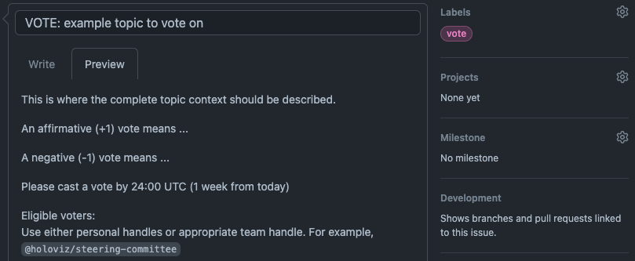

# Governance Policy

The "Project" is herein defined as the activities related to this specific GitHub repository [`HoloViz`](https://github.com/holoviz/holoviz), within the `HoloViz` GitHub Organization. This purpose of this repository is primarily to host the development activities of the HoloViz.org website. This repository also hosts the HoloViz Organization governance documents, that apply to the wider HoloViz ecosystem.

This document provides the governance policy for the Project. Members agree to this policy and to abide by all Project polices, including the [code of conduct](../org-docs/CODE-OF-CONDUCT.md), [trademark policy](../org-docs/TRADEMARKS.md), and [antitrust policy](../org-docs/ANTITRUST.md) by adding their name to the [MEMBERS.md file](./MEMBERS.md).

## 1. Project Member Roles

This project may include the following roles. Additional roles may be adopted and documented by the Project. All member role terms may be indefinite, as long as the members adhere to the Organization's policies.

**1.1 Maintainer**. Maintainers are responsible for organizing activities around developing, maintaining, and updating the Project. Specifically, this includes making decisions about software and other technical aspects in code, services, documentation, or other materials that solely relate to this Project. Maintainers are also responsible for determining consensus. Maintainers are contributors that have an ongoing relationship to a project, and typically have GitHub merge permissions. Maintainers may be involved in different aspects of the Project, such as the code or the documentation. This Project may add or remove Maintainers with the approval (or simple majority vote if consensus is not reached) of the current Maintainers. When submitting substantial pull-requests, Maintainers should seek code review by another Maintainer. Maintainers may review and merge (or reject) pull-requests from Contributors, and seek Maintainers' consensus when appropriate. If a Maintainer is unresponsive at their listed handle for more than three months, the Maintainers may vote to remove the member, regardless of any further positions held (Lead Maintainer, Project Lead, etc).

**1.2 Lead Maintainer**. The Lead Maintainer is a Maintainer who is responsible for day-to-day management of the Project, including making releases if such a role has not been further delegated. The Maintainers may elect or remove a Lead Maintainer through consensus or simply majority vote if consensus is not met. During their term, the Lead Maintainer should maintain a high level of involvement in the maintenance of the Project.

**1.3 Project Lead**. The Project Lead is a Maintainer that will have the final say on the project direction and management, unless overridden. By default and whenever possible, the Project Lead should defer to the consensus forming process of the Maintainers. Maintainers may override a Project Lead by 3/4 vote. Maintainers may elect or remove a Project Lead by 4/5 vote. During their term, the Project Lead should maintain a high level of involvement in most types of activity with the Project, such as advocacy, planning, support, review, and development. The Project Lead also assumes Lead Maintainer duties by default, if this role is vacant.

**1.4 Contributors**. Contributors are those that have made contributions to the Project. Contributors can participate in the project by submitting, reviewing, and discussing GitHub Pull Requests and Issues and participating in open and public HoloViz Organization discussions on GitHub, Discourse, Slack, Gitter, Twitter, StackOverflow, or other communication channels. Contributors may also participate in live events. Contributors may not vote along with Maintainers, but can submit their input on a given topic to be considered during a consensus forming process. Anyone can be a Contributor - they can be affiliated with a legal entity or none. Contributors typically do not have review or merge permissions for the Project, but may be granted such permissions by a Project Maintainer.

## 2. Decisions

**2.1. Consensus-Based Decision Making**. Projects make decisions through consensus of the Maintainers. While explicit agreement of all Maintainers is preferred, it is not required for consensus. Rather, the Maintainers will determine consensus based on their good faith consideration of a number of factors, including the dominant view of the Contributors and nature of support and objections. The Steering Committee will publicly and consistently document evidence of consensus, consensus date, and issue description. For example, these records may be recorded in meeting minutes or the comments on a GitHub Issue or Pull Request. If consensus cannot be reached, the Maintainers will make the decision by a simple majority vote, unless otherwise stated.

**2.2. Voting**. Any Maintainer may call a vote with reasonable notice to other Maintainers, setting out a reasonable deadline by which to cast a vote (at least 3 days). Any discussion may be conducted in person or electronically by text, voice, or video. The vote must take place in such a way that all Maintainers are notified that there is a vote and understand how to cast a vote. Individual vote counts should be recorded in a consistent and publicly accessible format that includes the date, proposer, and description. In any vote, each voting representative will have one vote. Except as specifically noted elsewhere in this charter, decisions by vote require a simple majority vote of all reachable and vote-participating members.

For example, a Maintainer decides to call for a vote on a technical issue that did not previously reach consensus. This Maintainer files an issue on the HoloViz repository that clearly details the context, states precisely what an affirmative ("+1") or negative ("-1") vote means in regards to the issue being voted on, tags other Maintainers of the Project by their handle (@...), starts the issue title with "VOTE:", and adds the "vote" tag. This proposing Maintainer also specifies a date by which a votes will be tallied - 1 week beyond the posting date. In this example, 7 Maintainers vote by the deadline, of which 5 vote affirmative, and therefore the issue is considered carried and the issue is closed.

Here is an example for using a GitHub issue for voting:

**2.3. Appeal Process**. Decisions may be appealed by opening an issue and that appeal will be considered by the Maintainers in good faith, who will respond in writing within a reasonable time. If the Maintainers deny the appeal, the appeal may be brought before the Organization Steering Committee, who will determine if the issue falls within their jurisdiction and respond in writing in a reasonable time.

**2.4 Quorum**. Unless otherwise stated, a quorum for a vote can be met with at least 50% of active members, and at minimum, 2 participants. For example, in a vote requiring a simple majority, with 10 active members, at least 5 must vote; if 5 vote, there must be 3 affirmative votes. If there are 3 active members, at least 2 must vote; if 2 vote there must be 2 affirmative votes.

## 3. How We Work

**3.1. Openness**. Participation is open to anyone who is directly and materially affected by the activity in question. There shall be no undue financial barriers to participation.

**3.2. Balance**. The development process should balance the interests of Contributors and other stakeholders. Contributors from diverse interest categories shall be sought with the objective of achieving balance.

**3.3. Coordination and Harmonization**. Good faith efforts shall be made to resolve potential conflicts or incompatibility between releases in this Project.

**3.4. Consideration of Views and Objections**. Prompt consideration shall be given to the written views and objections of all Contributors.

**3.5. Written procedures**. This governance document and other materials documenting this project's development process shall be available to any interested person.

## 4. No Confidentiality

Information disclosed in connection with any Project activity, including but not limited to meetings, contributions, and submissions, is not confidential, regardless of any markings or statements to the contrary.

## 5. Trademarks

Any names, trademarks, logos, or goodwill developed by and associated with the Project (the "Marks") are controlled by the Organization. Maintainers may only use these Marks in accordance with the Organization's trademark policy. If a Maintainer resigns or is removed, any rights the Maintainer may have in the Marks revert to the Organization.

## 6. Amendments

Amendments to this governance policy may be made by affirmative vote of 2/3 of all Maintainers, with approval by the Organization's Steering Committee.

---
This document is based on GitHub MVG-0.1-beta, which is Licensed under the [CC-BY 4.0 License](https://creativecommons.org/licenses/by-sa/4.0/).
